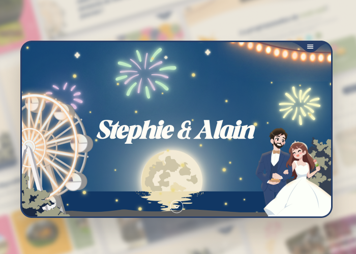

# Wedding Website 👰

Creation of a wedding website to extend and enhance the existing printed communications I created (save the date, RSVP), while facilitating the organization and guest experience. 
— 
Entirely designed and developed in React, this project allowed me to put into practice my recently acquired knowledge of this framework.

### It was build with...
* HTML
* CSS
* JavaScript
* React

## Contact
[Sabrina Le Gall](mailto:minalg.contact@gmail.com)
